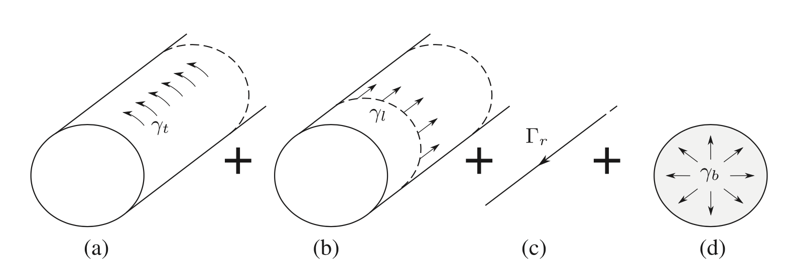
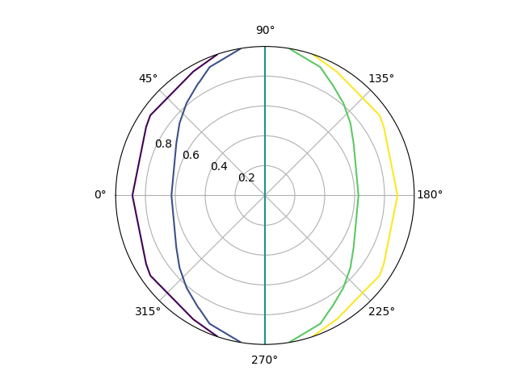
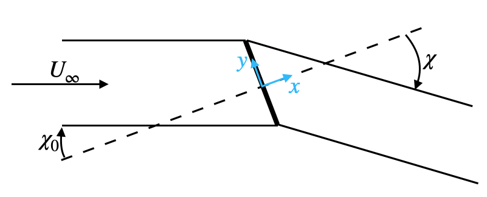
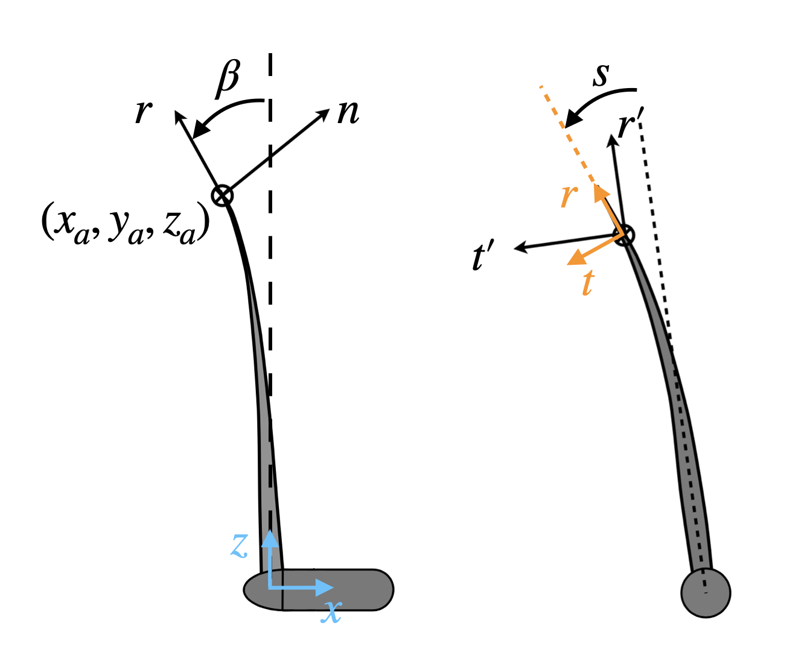

# Cylinder wake model

We explain how the cylinder wake model is implemented, and we go over the related modifications in the BEM equations.

The purpose of this model is to account for radial flow components, and wake skewness. It can be seen as a generalization of other skewed inflow models such as Pitt & Peters, etc. It is based on a cylindrical representation of the wake, as proposed in [Branlard2015] and [Branlard2016]. As argued in [Crawford2006] and [McWilliams2011], the so-derived BEM has improved accuracy for cases with precone and yaw.


## Induced velocities

!!! note
    For details on this section, see \[Branlard2016\]. Illustrations from this section are also mostly taken from there.


The wake geometry of the wake is assumed fixed. It is composed of a semi-inifinite outer cylindrical vortex sheet of radius `R`, a disk vortex sheet at the location of the rotor and a semi-infinite root vortex filament. The disk has a purely radial vorticity component, and the outer cylindrical sheet has two separate components: axial and tangential. 
The vorticity/circulation in those elements is assumed uniformly constant.



All the vortex instensity components in the different wake objects are related, see [Branlard2016, 2.3]. For now, let us assume that they are all linearly dependant on ``\gamma_t``. This will be convenient since the usual result from the Biot-Savart law is ``u_{x_0} = \gamma_t / 2``, where ``u_{x_0}`` is the velocity induced at the edge of a straight circular cylinder with uniform tangential vorticity.

To include yaw, we allow the wake to be skewed by an angle ``\chi`` with respect to the rotor frame of reference. Mind the coordinate system attached to the rotor, which does not follow wind turbine conventions!


In those conditions, we can compute the velocity induced by each of the vortex component (for a given ``\gamma_t``) from each object on a point located on the rotor disk.  This comes down to numerically integrate [Branlard2016, eq.5-8], which we do with Gauss-Legendre quadrature.


For example, we set ``\chi = 30 ^\circle``, ``\gamma_t = -1``. The axial velocity (z) induced by the tangential component of the outer vorticity cylinder (t) is ``u_{z,t}``:




The radial and tangential velocities induced by the tangential component of the outer vorticity cylinder (resp. ``u_{r,t}``, ``u_{\psi,t}``) are also shown:


Similarly, the axial velocity induced by the root vortex ``u_{z,r}``:


!!! note
    The dominating  wake component on the induced velocities are those from the tangential vorticity in the outer cylinder, and the axial vorticity in the root vortex, see [Branlard2016, sect.4].


From here on, we resume with standard wind-turbine conventions regarding frame of references.

Hence, we showed that the induced veloctities at the rotor can be expressed as
```math
\begin{aligned}
u_x &= I_x \gamma_t \\
u_r &= I_r \gamma_t \\
u_\psi &= I_\psi \gamma_t
\end{aligned}
```
where the ``I`` factors depend on the above integrals.

For the sequel, it will be convenient to define `epsilon factors`. The conventional result generally corresponds to ``\epsilon_x=1``.
```math
\begin{aligned}
u_x \epsilon_x &= \gamma_t / 2 \\
u_x \epsilon_r &= u_r \\
u_x \epsilon_\psi &= u_\psi
\end{aligned}
```
such that
```math
\begin{aligned}
\epsilon_x &= 1 / (2 I_x) \\
\epsilon_r &= 4 I_x I_r \\
\epsilon_\psi &= 4 I_x I_\psi
\end{aligned}
```

!!! note
    **Relation to other skewed wake models**

    As noted in [Branlard2016], the cylinder wake model can be seen as a generalization of other models that have been proposed to treat yaw.
    The relation between these models and the current one is established by noticing that the axial inducation has the form of the model proposed by Glauert:

    ```math
    a = \gamma_t / 2 (1 + K \sin\psi)
    ```
    where ``K`` has an expression that depends on the model.

    For the `Coleman et al.` model for instance, 
    ```math
    K_{\textrm{PittPeters}} = \frac{r}{R} \tan(\chi/2)
    ```
    The `Pitt & Peters` model gives, 
    ```math
    K_{\textrm{Coleman}} = \frac{r}{R} \frac{15\pi}{32} \tan(\chi/2)
    ```
    although some authors proposed to use a factor ``15\pi/64`` instead (see [Ning2015]).
    Other models can be found in the litterature (see e.g. [Micallef2016])

    In the present model, ``a`` is influenced by the various component of vorticity in the wake. In that sense it is mode general. However, the velocity induced by the tangential vorticity in the cylinder also has the form ``u_{x,t} / U_\infty = \gamma_t / 2 (1 + K_{x,t} \sin\psi)``, where ``K_{x,t}`` takes the form of an integral that needs to be computed numerically. Furthermore, in the case where we consider only the velocity induced by the tangential component of the tip vorticity (neglecting all the other wake components), and linearizing ``K_{x,t}``, we finally recover the `Coleman et al.` model.


## Adapted BEM equations

We re-develop the BEM equations following the same logic as in [Ning2021], but for the general case of a turbine with yaw and non-straight/preconed blades. We make use of the definitions of the epsilon factors, and the standard definition of the induction factors:

```math
a = \frac{u_x}{U_\infty} \quad a' = \frac12 \frac{u_\psi}{r\Omega}
```

We refer the interested reader to [Branlard2015, sect.4.2] (and refs. therein) for a formal explanation of the relation between the BEM theory and the vortex-induced velocity.

!!! warning
    Conventions may be confusing. Here we consider that a will be negative for a turbine... and we shouldn't do that. TODO: change sign on a and remind that sign change between quantities for prop and turbines

We account for a yaw angle ``y``. At a given radial station ``r`` measured along the blade, the local coning and sweep angles are ``\beta`` and ``s``, and the distance to the rotor shaft is ``r_a``. 

The main idea of this development is to relate the local forces on the blades (which depend on the 2D aerodynamics expressed in a plane normal to the deflected blade) to the updated  momentum equations.


!!! note
    Generally, the yaw angle ``y`` is smaller than the skew angle ``\chi``. See references in [Branlard2016, sect.2.1] for relations between them. If we neglect the tilt angle, we can simply use the relation from Burton's Wind Energy handbook [Ning2015, eq.31]
    
    ```math
    \chi = (0.6 a + 1) \chi_0
    ```

    :warning: should clarify if ``a = u_x/U_\infty`` or ``a = u_{x_0}/U_\infty``
    
    

### Reference frames

Just as a reminder, figures are modified from [Ning2015].

**Rotor related frame:**


We will express the momentum in the direction normal to the rotor plane (after yaw and tilt). That is where our ``x,y,z`` coordinate system is defined. 


**Blade related frames:**



Note that ``\beta`` is the local coning angle (that accounts both for precone and flapwise bending).


Given a position on the rotor parametrized by ``x_a,y_a,z_a``, and rotor info ``\psi,\Theta,\chi_0``, one can obtain the componnents of the upstream velocity and rotational velocity in the rotor (``x,y,z``) frame. 
```math
\begin{aligned}
V_x &= ...\\
V_y &= ...
\end{aligned}
```
<!-- Similar to eq28 in Ning2015 (the radial component missing), but with 0 coning and with the possible shift in x,y,z that will affect r_a and the sweep is gonna make it even more messy. Forget about sweep? -->


### Rotor mass flow

For an anular section ``A_a = 2 \pi r_a dr``:

```math
\dot{m} = \rho A_a (U_\infty \cos(y) + u_x ) = \rho U_\infty A_a (\cos(y) + a)
```

### Thrust coefficient

With the Prandtl loss function ``F``:
```math
T = \frac12 \rho U_\infty^2 A_a C_T = \dot{m} \Delta V F
```
where the ``Delta`` is taken between far-field velocities measured normally to the rotor
```math
\Delta V = ( U_\infty \cos(y) - (U_\infty \cos(y) - \gamma_t \cos(\chi)) ) = \gamma_t \cos(\chi) = 2 u_x \epsilon_x \cos(\chi) U_\infty
```
Thus
```math
C_T = 4 (\cos(y) + a) a \epsilon_x \cos(\chi) F
```

!!! warning
    The latter expression is different from that proposed in [McWilliams2011]: ``C_T = 4 (\cos(y) + \epsilon_x a) u_x \epsilon_x``.
    It is also different from Glauert's theory, see in [Ning2015]: ``C_T = 4 sqrt{ 1 - a (2 \cos(y) - a)} a F``.
    It gets however much closer to the propeller-brake/momentum region [Ning2021]


### Torque coefficient

```math
Q = \frac12 \rho U_\infty^2 A_a r_a C_Q = \dot{m} r_a u_\psi F = \dot{m} r_a (2 a') (r_a \Omega) F
```

```math
C_Q = 4 a' (\cos(y) + a) r_a \Omega / U_\infty
```

### Airfoil aerodynamics

The 2-D aerodynamics has to be expressed in a plane normal to the blade axis. Note that the blade is allowed to deflect, and may have a local coning and sweep angle.

!!! danger
    TODO: fig of the plane normal to the blade: r,ra,s,beta


By definition, ``\tan(\phi) = \frac{U_n}{U_t}`` that we can rewrite

```math
\frac{ \sin(\phi) }{ U_n } - \frac{ \cos(\phi) }{ U_t } = 0
```

The local 2-D aerodynamics  yields forces parallel to the normal and tangential direction:
```math
\begin{aligned}
f_n &= \frac12 \rho W^2 c c_n(\phi) dr\\
f_t &= \frac12 \rho W^2 c c_t(\phi) dr
\end{aligned}
```
and we need to express these forces in the coordinate system associated with the rotor disk
```math
\begin{aligned}
f_x &= \frac12 \rho W^2 c c_1(c_n,c_t,\beta,s) dr \\
f_\psi &= \frac12 \rho W^2 c c_2(c_n,c_t,\beta,s) dr
\end{aligned}
```
where ``c_1,c_2`` are coordinate transformations.

Similarly, we need to express ``W, U_n, U_t`` as a function of the velocities in the rotor c.s.:
```math
[U_n, U_t, U_{//}]^T = A [U_x, U_\psi, U_r]^T
```
with
```math
\begin{aligned}
U_x &= U_\infty(\cos(y) + a) \\
U_\psi &= \Omega r_a (1-a') \\
U_{//} &= U_\infty a \epsilon_r
\end{aligned}
```

!!! danger
    rewrite this as function of velocities with tilt, yaw etc. I miss the component of inflow vel in the // dir
    caution, this actually also depends on the sweep, coning, etc...?
    What does really matter here? 
        1. a is epxressed in the frame before tilt
        2. given any position on the rotor parametrized by x,y,z,psi,Theta,chi0: I must be able to obtain the velocity in the rotor (xyz) frame. Similar to eq28 in Ning2015 (the radial component missing), but with 0 coning and with the possible shift in x,y,z that will affect r_a and the sweep is gonna make it even more messy. Forget about sweep?
        3. In the end, I will have: Vx,Vy,Vz that I can turn into Ux,Uy,Uz with the induction, and then into U_n, U_t

!!! warning
    Am I missing a factor 2 with a'?

!!! danger
    TODO: write my matrix A
    double check that I am not crazy when I obtain that 


The full expression reads

```math
\begin{aligned}
U_n &= U_\infty ( \cos(\beta) ( \cos(y) + a) - \sin\beta a \epsilon_r ) \\
U_t &= U_\infty ( \sin(s) \sin(\beta) ( \cos(y) + a) + \sin(s) \cos\beta a \epsilon_r ) + r_a\Omega \cos(s) (1-a')
\end{aligned}
```

In the end, neglecting the sweep angle (or more precisely, considering sweep only through a shear and no change in direction)

```math
\begin{aligned}
U_n &= U_\infty ( \cos(\beta) ( \cos(y) + a) - \sin\beta a \epsilon_r ) \\
U_t &= r_a \Omega (1-a')
\end{aligned}
```


### BEM equations

We equate the momentum equations and the local 2D aerodynamics, in order to obtain a expression for ``a,a'`` as a function of ``\phi``. Then, we can use the 1-residual equation

```math
R(\phi) = \frac{ \sin(\phi) }{ U_n } - \frac{ \cos(\phi) }{ U_t } = 0
```

Also, `` W = \frac{U_n}{\sin \phi} = \frac{U_t}{\cos \phi}``.

We express the axial momentum
...
```math
\frac{(\cos(y) + a) a}{(\cos\beta (\cos(y) + a) - \sin\beta a \epsilon_r)^2} = \frac{c c_1}{2\pi r_a \epsilon_x \cos(\chi) F}
```

We can solve for ``a``.
```math
a = \cos(y) \frac{... \pm \sqrt{...} }{...} 
```

The tangential equilibrium yields
...
```math
\frac{a'}{1-a'} = ... (a,y,\phi,...)
```

!!! note
    We never used ``\epslon_\psi`` so far. One possibility would be to replace the last equation (tangential equilibrium) with 
    ```math
    a' = \epsilon_\psi \frac{u_x}{r_a\Omega} = a \epsilon_\psi \frac{U_\infty}{r_a\Omega}
    ```
    This might not be more accurate, though.


### Summary of the assumptions
- we neglect the influence of the bound vortices of the other blades on the current blade. This is valid if all the blade have the same circulation, which is not exactly the case in yaw or with shear.
- we neglect the influence of the longitudinal vorticity components of the tip cylinder on the velocity measured normal to the disk 
- we still assume the independance of each annular section (theoretically only valid for no yaw, no cone, and high TSR  [Branlard2015]). Otherwise, the determination of the axial induction at a given radial station would depend on all the other sations, requiring to solve a large system of equations (see also [Branlard2015, sect.4.3]). 
- the wake geometry is assumed as explained above: no wake expansion, plus the wake vorticity is only shed at the blade root and the blade tip.    The wake expansion could be taken into account by a discretization in the axial direction [Crawford2006] and iterations... But anyway, the wake expansion results in an increase of induction near the tip, which is overtaken by the Prandtl tip correction.

- we neglect the sweep angle in the computation of the normal and tangential velocities (this angle should be small anyway)
- we neglect the wake redirection by the tilt angle (i.e., the wake is parallel to the ground)

- we neglect the blade flap when evaluating the `epsilon` factors. The reason is that the cylider wake model is centered on the rotor hub, and does not come forward when the blades bend.

## TODO

- [ ] replace Uinf and ROm by Ux and Uy --> this also means change all the U_inf*cos(y)
- [ ] Tilt: give the expression of Ux and Uy as in Ning2015a. Caution: wake velocities 
- [ ] change sign of a everywhere. a is always positive so things should read Uinf(1-a)... or not since it is not like that in Ning2021?
- [ ] introduce deflection velocities (directly in the residual equation?)
- [ ] notations: the yaw angle should be \chi_0 or something
- [ ] smoothly connect to the high induction model. Treat the particular cases ofsome missing velocities
- [ ] make sure the frames I use (and essentially psi) is consistent
- [ ] would it be better to pre-evaluate epsilon and look it up during BEM computation, or can we just keep re-evaluating it on the run?

## References

- [\[Branlard2016\]](https://doi.org/10.1007/s11044-015-9488-1) Branlard, E. and Gaunaa, M. Cylindrical vortex wake model: skewed cylinder, application to yawed or tilted rotors. Wind Energy, 2016.
- [\[Branlard2015\]](https://doi.org/10.1002/we.1800) Branlard, E. and Gaunaa, M. Cylindrical vortex wake model: right cylinder. Wind Energy, 2015.
- [\[Crawford2006\]](https://doi.org/10.1002/we.197) C. Crawford. Re-examining the precepts of the blade element momentum theory for coning rotors. Wind Energy, 9(5):457–478, 2006.
- [\[McWilliams2011\]](https://doi.org/10.2514/6.2011-540) M. McWilliam, S. Lawton, S. Cline, and C. Crawford. A corrected blade element momentum method for simulating wind turbines in yawed flow. In 49th AIAA Aerospace Sciences Meeting including the New Horizons Forum and Aerospace Exposition, 2011.
- [\[Micallef2016\]](https://doi.org/10.1115/OMAE2018-78219) D. Micallef and T. Sant. A review of wind turbine yaw aerodynamics. Wind Turbines-Design, Control and Applications, 2016.
- [\[Ning2015\]](https://doi.org/10.2514/6.2015-0215) A. Ning, G. Hayman, R. Damiani, and J. M. Jonkman. Development and validation of a new blade element momentum skewed-wake model within aerodyn. In 33rd Wind Energy Symposium, 2015.
- [\[Ning2021\]](https://doi.org/10.1007/s00158-021-02883-6) Ning, A., Using Blade Element Momentum Methods with Gradient-Based Design Optimization, Structural and Multidisciplinary Optimization, May 2021.
  